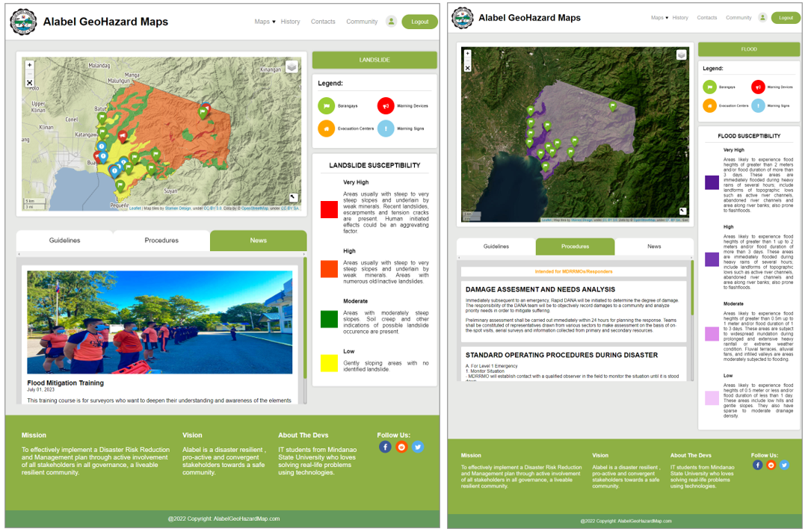

# Alabel-GeoHazard-Maps
 A university capstone project that provides the local government of Alabel with modern methods of disseminating geohazards/geoscience information. Our project focuses on providing a user-friendly platform that enables authorized personnel to plot areas prone to landslides and floods within the selected scope. Built using the popular web framework Django and leveraging the capabilities of the Python library 'folium' for leaflet maps.

The system incorporates interactive maps where each marker represents a specific location and provides essential geohazard information. Users can click on these markers to access detailed data, including the nearest evacuation center, population statistics of the area, and estimated walking or vehicle speed towards the evacuation site. 

Below was a sample image of when a certain marker is clicked

 The project empowers the public to report geohazard incidents such as floods, landslides, and sinkholes within the designated scope. By providing a user-friendly platform for incident submission, we enable individuals to contribute valuable information and enhance overall situational awareness. This collaborative approach promotes community engagement and supports effective disaster response and mitigation efforts.

